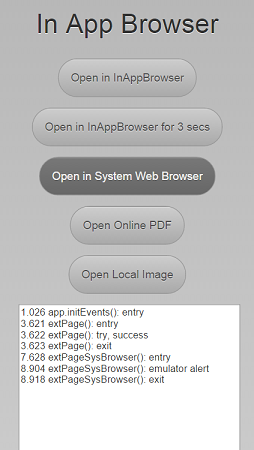

# InAppBrowser Tutorial #
================================

This sample app shows how to use the following Cordova* InAppBrowser API methods:

- addEventListener(): Adds a listener for an event from the InAppBrowser.
- window.open(): Opens a new browser window. For Android devices, opens the default browser. For iOS devices, opens the InAppBrowser.
- close(): Closes the InAppBrowser window.

## Sample Contents ##

The app illustrates opening a webpage in InAppBrowser, Open a webpage and closing it in 3 seconds using the close() method, opening a webpage in system browser, opening an online PDF file and opening a local image file. 

## Important files ##

`js/init-app.js` - The initialization place for your code.  App init point (runs on custom app.Ready event from `xdk/init-dev.js`). Runs after underlying device native code and webview/browser is ready.

`js/app.js` - Contains methods that binds the buttons click events to the proper handler. 

Here is an example method to open a webpage in the system web browser:

    function extPageSysBrowser() {
    "use strict";
    var fName = "extPageSysBrowser():";
    console.log(fName, "entry");
    try {
        if (window.tinyHippos) {
            emulatorAlert();
            console.log(fName, "emulator alert");
        } else {
            var ref = window.open('http://html5test.com', '_system', 'location=yes');
            console.log(fName, "try, success");
        }
    } catch (e) {
        console.log(fName, "catch, failure");
    }

    console.log(fName, "exit");
    }

